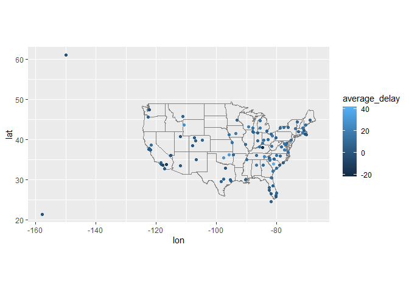
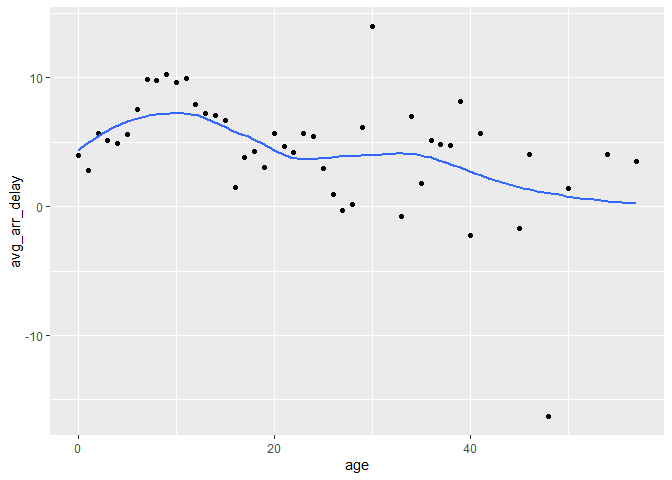
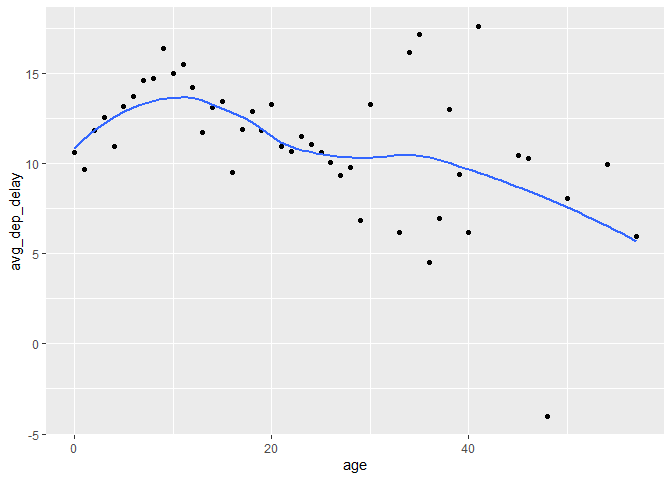

433 hw3
================
Lejun Xu
2022-10-19

``` r
library(nycflights13)
```

    ## Warning: 程辑包'nycflights13'是用R版本4.1.3 来建造的

``` r
library(dplyr)
```

    ## 
    ## 载入程辑包：'dplyr'

    ## The following objects are masked from 'package:stats':
    ## 
    ##     filter, lag

    ## The following objects are masked from 'package:base':
    ## 
    ##     intersect, setdiff, setequal, union

``` r
library(ggplot2)
library(tidyverse)
```

    ## -- Attaching packages --------------------------------------- tidyverse 1.3.1 --

    ## v tibble  3.1.6     v purrr   0.3.4
    ## v tidyr   1.2.0     v stringr 1.4.0
    ## v readr   2.1.2     v forcats 0.5.1

    ## -- Conflicts ------------------------------------------ tidyverse_conflicts() --
    ## x dplyr::filter() masks stats::filter()
    ## x dplyr::lag()    masks stats::lag()

1.  Compute the average delay by destination, then join on the airports
    data frame so you can show the spatial distribution of delays.
    Here’s an easy way to draw a map of the United States:

``` r
ADBD=flights %>% 
  group_by(dest) %>%
  summarize(average_delay = mean(arr_delay, na.rm = TRUE)) %>%
  left_join(airports, by = c('dest' = 'faa')) %>%
  ggplot(aes(lon, lat, color = average_delay)) +
  borders('state') +
  geom_point() +
  coord_quickmap()
ADBD
```

    ## Warning: Removed 4 rows containing missing values (geom_point).

<!-- -->

2.Add the location of the origin and destination (i.e. the lat and lon)
to flights.

``` r
flights %>% 
  left_join(airports, by = c('dest' = 'faa')) %>%
  left_join(airports, by = c('origin' = 'faa'), 
            suffix = c('_dest', '_origin')) %>%
  select(dest, origin, lat_dest,lon_dest, lat_origin, lon_origin)
```

    ## # A tibble: 336,776 x 6
    ##    dest  origin lat_dest lon_dest lat_origin lon_origin
    ##    <chr> <chr>     <dbl>    <dbl>      <dbl>      <dbl>
    ##  1 IAH   EWR        30.0    -95.3       40.7      -74.2
    ##  2 IAH   LGA        30.0    -95.3       40.8      -73.9
    ##  3 MIA   JFK        25.8    -80.3       40.6      -73.8
    ##  4 BQN   JFK        NA       NA         40.6      -73.8
    ##  5 ATL   LGA        33.6    -84.4       40.8      -73.9
    ##  6 ORD   EWR        42.0    -87.9       40.7      -74.2
    ##  7 FLL   EWR        26.1    -80.2       40.7      -74.2
    ##  8 IAD   LGA        38.9    -77.5       40.8      -73.9
    ##  9 MCO   JFK        28.4    -81.3       40.6      -73.8
    ## 10 ORD   LGA        42.0    -87.9       40.8      -73.9
    ## # ... with 336,766 more rows

3.Is there a relationship between the age of a plane and its delays?

``` r
plane_age1 <- inner_join(flights,
  select(planes, tailnum, p_year = year),
  by = "tailnum") %>%
  mutate(age = year - p_year) %>%
   filter(!is.na(age)) %>%
  group_by(age) %>%
 summarise(
    avg_arr_delay = mean(arr_delay, na.rm = TRUE),
 ) %>% 
  ggplot(aes(x = age, y = avg_arr_delay)) +
  geom_point() +
  geom_smooth(se = FALSE)
plane_age1
```

    ## `geom_smooth()` using method = 'loess' and formula 'y ~ x'

<!-- -->

``` r
plane_age2 <- inner_join(flights,
  select(planes, tailnum, p_year = year),
  by = "tailnum") %>%
  mutate(age = year - p_year) %>%
   filter(!is.na(age)) %>%
  group_by(age) %>%
 summarise(
    avg_dep_delay = mean(dep_delay, na.rm = TRUE),
 ) %>% 
  ggplot(aes(x = age, y = avg_dep_delay)) +
  geom_point() +
  geom_smooth(se = FALSE)
plane_age2
```

    ## `geom_smooth()` using method = 'loess' and formula 'y ~ x'

<!-- --> Based on these
two plots, the age of the plane has very little relationship to
delay,i.e. as the age of the plane increases,the average delay time
decreases.
